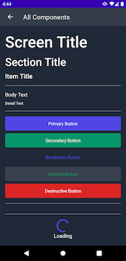
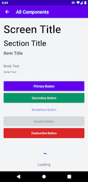

# Nice Components

A simple library with some nice looking Jetpack Compose UI components to get your next project started 🚀

Help jump start your prototypes with some sensible default components, then come back later and customize the look and feel of your app all in one place.





## Usage

### Example Project

You can clone and run the example project to see examples of all the default components, plus a little sample of a more customized sign in screen.

### Straight out of the Box

```kotlin
@Composable
fun DemoView() {
    NiceComponentsTheme {
        ScreenTitle("I'm a nice big title!")
    }
}
```

### Customizing Components

Once you're ready to start putting your own touch on components, you've got a couple options, based on what you'd like to change...

#### Setting a Global Config at Startup

If you'd like to change _all_ instances of a component, we recommend creating a custom config that you can set when your app first starts. Note that you once you've set this config, you'll be unable to update it.


In the case of multiple customizations applying to the same component, the _most specific_ one will take precedence.

```kotlin
class MainActivity : ComponentActivity() {
    override fun onCreate(savedInstanceState: Bundle?) {
        super.onCreate(savedInstanceState)
        setContent { 
            val config = Config.default.copy(
                primaryButtonStyle = Config.default.primaryButtonStyle.copy(
                    surfaceColor = Color.Red,
                    onSurfaceColor = Color.Black
                )
            )
            NiceComponentsTheme(config) {
                // your content here
            }
        }
    }
}
```


#### Extending an Existing Component

```kotlin
@Composable
fun CustomPrimaryButton(text: String, onClick: () -> Unit) {
    PrimaryButton(
        text = text,
        buttonStyle = ButtonStyle(
            textStyle = CurrentConfig.typeTheme.body1,
            surfaceColor = Color.Red,
            onSurfaceColor = Color.Black
        ),
        onClick = onClick
    )
}
```

#### Customizing a Single Instance of a Component

```kotlin
@Composable
fun Example() {
    PrimaryButton(
        text = "Tap me!",
        buttonStyle = ButtonStyle(
            textStyle = CurrentConfig.typeTheme.body1,
            surfaceColor = Color.Red,
            onSurfaceColor = Color.Black
        )
    ) {
        println("I've been tapped!")
    }
}
```

### Using `StatefulView`

We've found with Jetpack Compose it's very common to have a view whose state changes based on some content state defined in its ViewModel. With `StatefulView`, you can pass in your current state, and the desired loaded state and have things automatically update as your state changes. You can also update your error, loading and noData states to suit your needs.

See [StatefulExampleView](https://github.com/steamclock/compose_components/blob/main/Sample/app/src/main/java/com/steamclock/compose_components/views/StatefulExample.kt) for a full example.

### Setting a Color Palette

Components are colored using a theme inspired by the [Material Design color system](https://material.io/design/color/the-color-system.html#color-theme-creation).

| Component | Text Color | Background Color |
| ------------- | ------ | ------------ |
| Primary Button | onPrimary  | primary  |
| Secondary Button |  onSecondary | secondary |
| Inactive Button | background | secondary |
| Destructive Button | onError | error |
| Body Text | onSurface | n/a |
| Detail Text | onSurface | n/a |

```kotlin
class MainActivity : ComponentActivity() {
    override fun onCreate(savedInstanceState: Bundle?) {
        super.onCreate(savedInstanceState)
        setContent { 
            val lightColors = NiceComponentsLightColors.copy(
                primary = colorResource(id = R.color.design_default_color_primary),
                onPrimary = colorResource(id = R.color.design_default_color_on_primary)
            )
            val darkColors = NiceComponentsDarkColors
            val config = Config(colorTheme = if (isSystemInDarkTheme()) darkColors else lightColors)
            NiceComponentsTheme(config) {
                // content
            }
        }
    }
}

```

#### Setting a Custom Font

Just like how you can set a `colorTheme`, you can also set a `typeTheme` that defines the default font, size and weight for all components.

| Component | Type Name |
| ------------- | ------ | 
| Primary Button | button | 
| Secondary Button |  button | 
| Inactive Button | button | 
| Destructive Button | button | 
| Body Text | body1 | 
| Detail Text | body1 | 

```kotlin
    val config = Config.default.copy(
        primaryButtonStyle = Config.default.primaryButtonStyle.copy(
            TypeTheme.TextStyle(
                size = 16.sp,
                fontFamily = FontFamily.SansSerif,
                fontWeight = FontWeight.SemiBold
            )
        )
    )
    NiceComponentsTheme(config) {
        // content
    }
```


### Installation

Coming soon....
